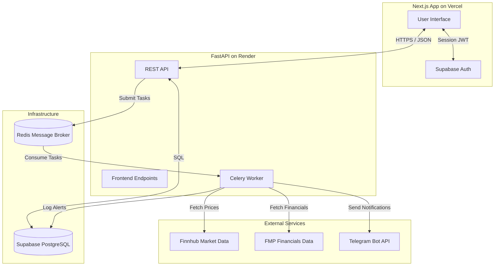

# StockAlert Progress Summary

This document serves as a comprehensive snapshot of the StockAlert platform's architecture and the features implemented from Phase 1 through Phase 4.

## System Architecture

---

## Completed Phases

### Phase 1: Database & Backend Foundation
- **Database (Supabase)**: Designed and implemented tables for `profiles`, `watchlist`, `alert_rules`, `alert_log`, and `telegram_verification_codes`. Configured Row Level Security (RLS) policies.
- **Backend Setup**: Initialized FastAPI project with CORS middleware and Supabase connection handling.
- **User Authentication**: Integrated Supabase JWT authentication to secure backend API endpoints.

### Phase 2: External APIs & Asynchronous Workers
- **Market Data Services**: Integrated **Finnhub** for real-time stock quotes and symbol search, and **FMP** for company financials.
- **Asynchronous Task Queue**: Set up **Celery** with a **Redis** message broker.
- **Polling System**: Created a scheduled polling task that loops through user watchlists and checks for alert conditions every minute (restricted to US market hours).

### Phase 3: Notification & Core Engine
- **Alert Engine**: Implemented logic to evaluate user-defined rules (e.g., `price_threshold`, `52w_high_low`, `unusual_volume`) against live market data.
- **Telegram Integration**: Created an automated system to fire off Telegram messages when alerts are triggered.
- **Keep-Alive**: Configured a `/health` endpoint and connected UptimeRobot to prevent the Render free tier from sleeping.

### Phase 4: Premium Frontend & Deployment
- **Frontend Architecture**: Initialized a Next.js (App Router) project with a custom glassmorphic dark-mode design system using pure CSS.
- **Authentication Pages**: Built `/login` and `/signup` with Supabase SSR integration.
- **Interactive Onboarding**: Created a multi-step wizard (`/onboard`) introducing users to Telegram linking via an innovative 6-digit code flow, adding their first stock, and reviewing default rules.
- **Dashboard**: Developed a responsive grid (`/dashboard`) showing live tracking cards with green/red visual indicators. Updated to use **batched API requests** for high performance.
- **Stock Detail**: Built `/stock/[symbol]` with dynamic inline-editing for alert thresholds and rule removal.
- **Alert History**: Added an `/alerts` timeline feed showing triggered events with custom icons.
- **Settings**: Created `/settings` to manage telegram connections and account deletion (Danger Zone).
- **Deployment**: Successfully pushed the backend to **Render** and the frontend to **Vercel**, fully wiring them together with environment variables and secure CORS settings.

---

## What's Next (Phase 5: Monetization)

We are now ready to implement the final major feature block:

1. **Stripe Integration**: Connect Stripe subscriptions to implement a Free vs. Paid tier system.
2. **Feature Gating**: Enforce limits (e.g., maximum of 3 tracked stocks on the Free tier) and allow unlimited access on the Pro tier.
3. **Webhook Processing**: Handle dynamic plan upgrades/downgrades automatically based on incoming Stripe payment events.

---

## Risk Analysis & Edge Cases

### 🔴 High Priority (System Failure / Data Loss)
- **Finnhub Rate Limits Exceeded**: The free tier of Finnhub limits calls to 60/minute. As the number of active tracked stocks grows, the Celery polling engine will quickly exhaust this limit, resulting in 429 errors and missed alerts.
- **Telegram Bot Blocking**: If a user stops the bot or blocks it on Telegram, the backend notification sender will throw `Forbidden: bot was blocked by the user`. If unhandled, this could crash the Celery notification worker queue.
- **Supabase Connection Exhaustion**: High-frequency concurrent polling tasks generating `INSERT` and `SELECT` queries across numerous users could hit Supabase DB connection pool thresholds.
- **Render Ephemeral Restarts**: Render restarts instances periodically. If a restart kills a Celery worker mid-message, an alert trigger might be lost and never delivered if tasks aren't defensively acknowledged late.

### 🟠 Medium Priority (UX Degradation / Logic Bugs)
- **Market Holidays & Half Days**: The current `is_market_open` logic relies purely on weekday and 9:30-16:00 EST clock checks. On holidays (like July 4th) or early closures, it will query Finnhub unnecessarily and waste API limits on stale data.
- **Telegram Rate Throttling**: Telegram limits bot broadcasting to 30 messages per second. A broad market event (e.g., S&P 500 crash) could trigger thousands of alerts simultaneously, resulting in Telegram dropping HTTP requests to the webhook.
- **Halted/Delisted Tickers**: If Finnhub returns `null` fields (e.g., `None` for current price `c`) due to a halt, the batch pricing or alert evaluator might raise a `TypeError`, freezing the loop for that stock.
- **Race conditions with Watchlist Deletions**: If a user deletes a stock from their watchlist right as the Celery task is reading it, a phantom rule evaluation could occur, or a DB insert for `alert_log` might fail foreign key constraints.

### 🟡 Low Priority (Minor Bugs & Display Issues)
- **Session Expiry Edge Case**: If a user idle-sleeps their PC on the settings page, wakes up a day later, and hits "Disconnect Telegram," the JWT may be expired causing a silent 401 fail.
- **Case Sensitivity Anomalies**: A user bypassing frontend searches (e.g., via direct API call `aApL`) might bypass unique DB constraints or break the frontend quote lookup map if `.upper()` is missed on the BFF API side.
- **Duplicate Linking Exploits**: Multiple accounts attempting to verify the exact same Telegram 6-digit code or link the same Chat ID, leading to duplicate notifications going to one chat thread.
- **Timezone Drift**: User's local browser clock drifting could marginally impact the "x minutes ago" formatting on the Dashboard polling widget.
